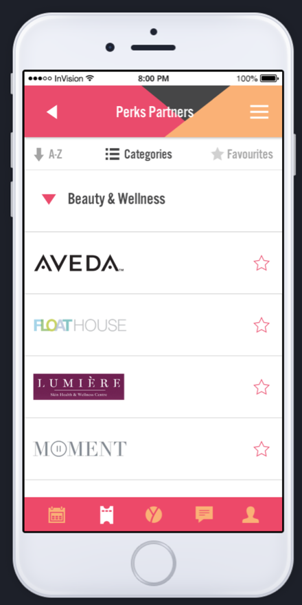

# Yes Vancouver Mobile App

Development repo for YES! Vancouver cross-platform mobile app. 

## Table of Contents
- [Description](#description)
- [Tech Stack](#tech-stack)
- [Getting Started](#getting-started)

## Description
This cross-platform mobile app (iOS, Android) is developed for [Yes Vancouver](http://yesvancouver.org/) and aims to provide the following functionalities:

- **Editable User Profile:**  
A user can create a profile on the Wild Apricot Membership Management site through the app. The user can then login to (and logout of) their profile in the app. Inside the app, the user can renew their membership and modify their profile details and settings.

    
    

- **Events Calendar:**  
A user can view a list of upcoming events as well as previous events. When a user clicks on an item in the events list, they will be navigated to a new screen that displays more details about the event and a link to the registration page.

    
    

- **Partner Perks:**  
A user with a valid membership can view a list of perks offered by Yes Vancouver's sponsors. When a user clicks on an item in the perks list, they will be navigated to a new screen that displays more details about the offer (eg. offer details, expiry date, discount code)

    
    

- **News Feed:**  
A user can read the recent news and blog posts published by Yes Vancouver.

    

- **Messaging:**  
A user can message other members that are registered with Yes Vancouver.

    
    

- **Push Notfications**  
A user can get push notifications to alert them of new events, new offers from sponsors, or renew their membership.

    
    

## Tech Stack

- Frontend: React Native
- Backend: [Wild Apricot](https://www.wildapricot.com/)

## Getting Started

1.  Install Node.js:  
    https://nodejs.org/en/
   

1.  Install Expo command line tool:  
    ```
    npm install expo-cli --global
    ```

1.  Install Expo Client app on phone:  
    Android: https://play.google.com/store/apps/details?id=host.exp.exponent&hl=en  
    iOS:
    https://itunes.apple.com/ca/app/expo-client/id982107779?mt=8

1.  Install git:  
    https://git-scm.com/book/en/v2/Getting-Started-Installing-Git
   

1. Clone the repository:
   ```
   git clone https://github.com/CodeTheChangeUBC/yes-vancouver.git
   ```
   
1. Navigate into the project's root directory:  
   ```
   cd yes-vancouver/YesVancouverApp/
   ```
   
1. Install node modules:  
   ```
   npm install
   ```

1.  Start the app:
    ```
    expo start
    ```

1.  Open the app by scanning the QR code with the Expo Client app on your phone or open using an emulator.
