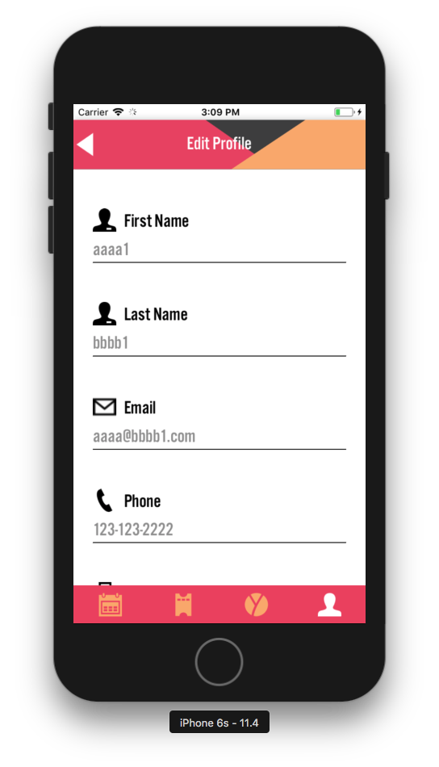

# Current Status of the Application
as of the last commit `03fbe4465cc1998a5a749640423ebeb94fae67ca` on August 20, 2018

## High Level Architecture Diagram


*Figure 1. High level architecture diagram that illustrates the relationships between different system components (as of August 20, 2018).*

## Description of system components

### Backend Server and Database

[Wild Apricot](https://www.wildapricot.com/) Membership Managment Software is currently used by Yes Vancouver to manage members and events. Wild Apricot exposes RESTful APIs that allow the mobile application to retrieve information about these members and events.

### Frontend React Native Mobile Application

#### Basic Layout

Most of the application is structured in a layered manner. These layers are organized using the following folders:

-  `src/apicalls/` - is the lowest layer of the application that makes REST API calls to the Wild Apricot server. Before retrieving the events and contact details from Wild Apricot, first a Bearer authentication token needs to be retrieved. This authentication token expires after a certain amount of time and needs to be included in the header of every API call to Wild Apricot when retrieving or modifying events and contact details.

- `src/lib/` - is the middle layer of the application that takes the data returned from the apicalls layer and packages the data into objects that can be easily consumed by the user interface components.

- `src/components` - is the top layer of the application that defines the user interface layout.

Not all of the application follow this structure. The `Login` and `Signup` component have not been refactored yet and trigger API calls directly. In the future, it would be nice to have all components follow a consistent structure, whether it is this one or a completely new structure, to improve maintainability.

#### Events Screen
-   `src/components/Events/EventsList.js`  
    When a user clicks on the calendar icon on the bottom navigation bar, they will see a list of upcoming and past events. Currently, there is no logic to sort the list of events by data and this should be implemented in the future. This screen can also handle edge cases like displaying multi-day events and displaying and 'Failed to retrieve events' message when the server cannot be reached.

-   `src/components/Events/EventsDetails.js`  
    When a user clicks on an event listed on the EventsList screen, they will be navigated into the EventsDetails screen that displays a more details about an event. Clicking on the register button navigates the user to the event registration webpage on Wild Apricot. Clicking on the 'Discussion Board' currently does nothing. Clicking on the share icons copies the event registration link to the clipboard where it may be shared in other applications. The way this page is rendered depends on how the event was created in Wild Apricot

    -   **Basic Event**  
        When an admin on Wild Apricot creates an event by filling in the system's mandatory fields (eg. location, date, time) for events and adding HTML to the event description, the EventsDetails screen on the app will display the mandatory fields on the top and below that render the HTML in using the `react-native-render-html` library.

        
        

        *Figure 2. Event containing only the basic details. Banner image is currently static. Date, time and location are fetched from Wild Apricot. 'Discussion Board' does nothing. Event description HTML is rendered as an HTML element at the bottom of the screen.*

    -   **Event with Additional Details**  
        In the Yes Vancouver app prototype, the EventsDetails screen contains a banner image, text description of the event, speakers, and sponsors. However, Wild Apricot does not support custom fields for Events. The challenge is finding a solution that keeps all the information about an event together in that Event entry on Wild Apricot, while not impacting the way the event is displayed on a Web browser. The current implementation requires an admin to add an XML document as an HTML comment to the end of the HTML description in an event entry on Wild Apricot. In the mobile app, this XML document is retrieved from the `DescriptionHtml` field of the events API response and then parsed for the banner image, event text description, speaker details, and sponsors.

        
        

        *Figure 3. Event containing additional details (banner image, custom text description, speaker details, sponsors) that are fetched from the event description HTML in Wild Apricot.*

        ```xml
        <additionaldetails>
            <eventbannerimageurl>
                https://yvsuper.wildapricot.org/resources/Pictures/Events/Event-Detail-Banner.png
            </eventbannerimageurl>
            <eventdetails>
                Event Description
            </eventdetails>
            <speaker>
                <firstname>FirstA</firstname>
                <lastname>LastA</lastname>
                <title>TitleA</title>
                <company>CompanyA</company>
                <role>RoleA</role>
                <imageurl>https://yvsuper.wildapricot.org/resources/Pictures/Events/Blank-Profile-Picture.png</imageurl>
            </speaker>
            <speaker>
                <firstname>FirstB</firstname>
                <lastname>LastB</lastname>
                <title>TitleB</title>
                <company>CompanyB</company>
                <role>RoleB</role>
                <imageurl>https://yvsuper.wildapricot.org/resources/Pictures/Events/Blank-Profile-Picture.png</imageurl>
            </speaker>
            <sponsorimageurl>https://hootsuite.com/uploads/images/craft/components/polaroid-images/HootsuiteLogo-Black.png</sponsorimageurl>
            <sponsorimageurl>https://cdn.vox-cdn.com/thumbor/Pkmq1nm3skO0-j693JTMd7RL0Zk=/0x0:2012x1341/1200x800/filters:focal(0x0:2012x1341)/cdn.vox-cdn.com/uploads/chorus_image/image/47070706/google2.0.0.jpg</sponsorimageurl>
        </additionaldetails>
        ```
            
        *Figure 4. Sample XML document describing additional details for events. This document can also be found in `src/components/Events/EventsAdditionalDetails.xml`. Document can contain zero or multiple speaker and sponsor items.*

        

        *Figure 5. Click the 'Edit' button of the Wild Apricot event to edit the event.*

        

        *Figure 6. Click 'HTML' button under the description section of the event to edit the HTML of the event.*

        

        *Figure 7. Paste the XML document describing the event's additional details as an HTML comment at the end of the event description's HTML. It is added as a comment so this extra information will not affect the way the event is rendered on a web browser. Then click Save to save the modified event description.*

        

        *Figure 8. Click the 'Save' button to save the changes made to the event.*

#### Perks Screen

-   `src/components/Perks/PerksList.js` 
    Currently this screen displays a static list of sponsors. In the future, these sponsors and their logos should be fetched dynamically from the server. The issue is Wild Apricot does not have support for sponsors. Currently, the solution is to add a Contact in Wild Apricot to represent a sponsor and add some custom field. Sorting the sponsors alphabetically and categorically and favoriting sponsors has not been implemented.

    

    *Figure 9. PerksList screen.*

-   `src/components/Perks/PerksDetails.js` 
    Currently this screen displays static details about a sponsor and this information needs to be dynamically fetched from the server.

#### Newsfeed Screen

-   `src/components/NewsFeed/NewsFeedView.js`  
    When a user logins into the app, the NewsFeed screen will be initially displayed. Currently this screen just static images and text. In the prototype, this screen contains the fundraising goal and latest blog posts. May need to discuss with Yes Vancouver to clarify the requirements of this screen.

    

    *Figure 10. Newsfeed screen.*

#### Messaging Screen

-   `src/components/Messaging/MessagingView.js`  
    This feature was discussed with Yes Vancouver and will not be implemented due to its complexity. The tab on the bottom navigation bar for messaging has been commented out. Wild Apricot currently does not contain the functionality for messaging between members. To implement this feature in the app, an external database will be required. 

#### Profile Screen

-   `src/components/Profile/ProfileDetails.js`  
    This view can fetch both the essential and custom fields for a contact from Wild Apricot and display them. The profile picture is currently static. Work needs to be done to dynamically fetch the profile picture from Wild Apricot. Extend membership also currenly does nothing. This screen currently has two buttons that navigate to the `EditProfile` and `ChangePassword` screens.

    
    
    

    *Figure 11. ProfileDetails screen.*

-   `src/components/Profile/EditProfile.js`  
    This view allows a user to edit both the essential and custom text fields for a contact. When the form is submitted, Wild Apricot will be updated. Then the user will be navigated back to the `ProfileDetails` page, where they will see their updated details. Currently, uploading or editing a profile picture are not implemented.

    
    

    *Figure 12. EditProfile screen.*

-   `src/components/Profile/ChangePassword.js`  
    The visual layout of the ChangePassword screen is implemented but does not do anything. The PUT call to change the password has not been implemented. This call is very similar to the one done in `EditProfile`.

    

    *Figure 13. ChangePassword screen.*

#### Sign Up

-   `src/components/SignUp/SignUp.js`  
    This view allows a user to create an account on Wild Apricot inside the app. Currently there is basic email validation and the component does make an API call to Wild Apricot to create an account.

    

    *Figure 14. Signup screen*

-   After creating an account, the user will be navigated to screens where they are prompted to fill in custom profile details (eg.company, title, Linkedin, Facebook). Only the visual layout of these screens are implemented. Submitting these custom profile details to Wild Apricot has not been implemented yet.

    

    *Figure 15. Screen for entering work details into user's profile.*

    

    *Figure 16. Screen for entering social media details into user's profile.*

    

    *Figure 17. Screen for uploading a profile picture into user's profile.*

#### Authentication

-   `src/components/Login/LoginForm.js`  
    Currently, a user can login with their Wild Apricot credentials in the app and see their own profile information. Log out functionality has not been implemented yet.

    

    *Figure 18. Home Screen*

    

    *Figure 19. Login Screen*

-   `src/components/ResetPassword/ResetPassword.js`  
    Visual layout of forgot password screen is implemented according to the prototype. No logic yet for actually resetting the password. May need to change this interface because Wild Apricot does not appear to have an API for doing a password reset. May need to redirect the user to the Wild Apricot website where they can reset their password.

    

    *Figure 20. ResetPassword Screen*
