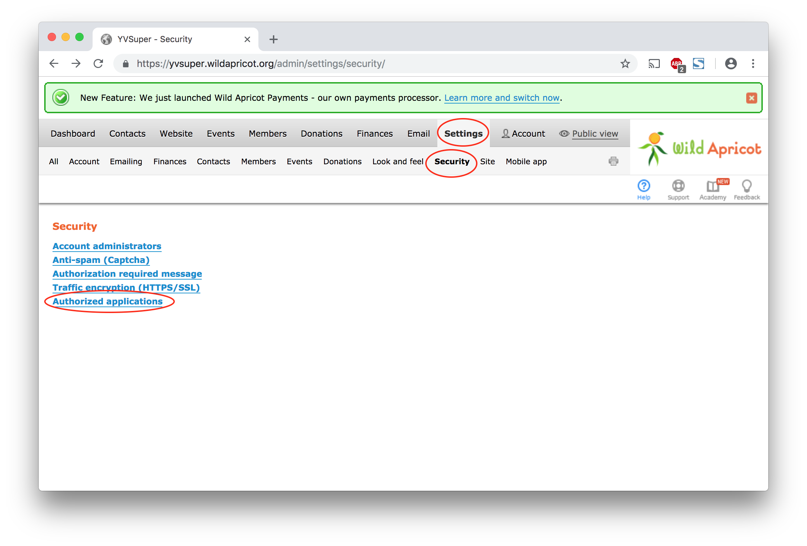

# Wild Apricot Server Setup
This document describes how to configure Wild Apricot and connect it with the React Native mobile application.

## Table of Contents
- [Config File](#config-file)
- [Custom Contact Fields](#custom-contact-fields)

## Config File
The config file contains the essential credentials needed to connect the React Native application with your Wild Apricot instance. The config file is located in `YesVancouverApp/config/config.js`.

```
// Sample config file
export const ClientSecrets = {
    ACCOUNT_NUM : '123456',
    API_USERNAME: '123456789',
    API_PASSWORD: '123456789',

    CLIENT_ID: '123456789',
    CLIENT_SECRET: '123456789',

    FQDN: 'https://<wild_apricot_name>.wildapricot.org'
}
```

*Figure 1. Sample config file*

The details required by the config file can be found in your Wild Apricot Instance. Please refer to the following screenshots:


*Figure 2. Find `ACCOUNT_NUM` and `FQDN` on the account dashboard in the admin view of Wild Apricot.*



*Figure 3. Navigate to `Settings` > `Security` > `Authorized Applications`. If an authorized application does not exist, create one.*


*Figure 4. Click on the authorized application.*


*Figure 5. In the Application details, find the `API_PASSWORD` (used for performing administrative actions like displaying a list of contacts, modifying contacts, displaying list of event registrations), `CLIENT_ID` and `CLIENT_SECRET` (used for individual user login, individual profile access). `API_USERNAME` is `'APIKEY'` by default.*

## Custom Contact Fields
Create the custom contact fields listed below to ensure that the mobile application does not crash.


*Figure 6. Custom contact fields that needs to be created.*
